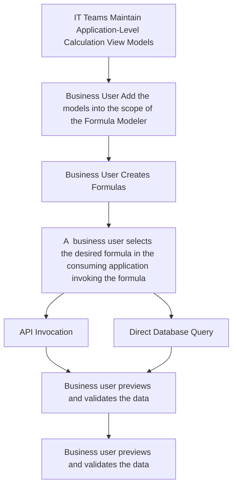
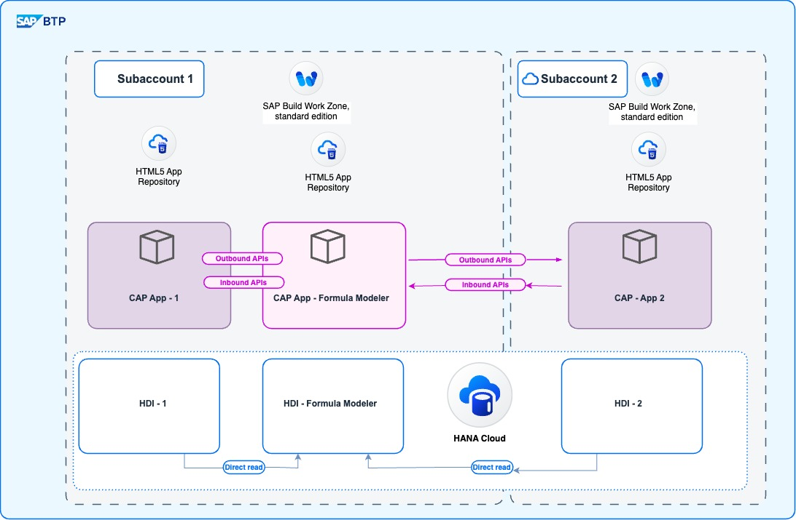

# Formula Modeler

## Overview

**Formula Modeler** is a full-stack application designed to be used by end users to create and manage formulas on IT curated data models(HANA). The tool enables centralized formula management and high-performance, in-memory calculations, making it easy for various business applications to consume and leverage these formulas without duplicating data.

---

## Key Features

- **Centralized Formula Management:** Maintain all business formulas in a single, standalone application.
- **Flexible Consumption:** Formulas can be consumed by multiple business applications (e.g., Sales, Finance, Pricing) without data or code duplication.
- **In-Memory Calculation:** All calculations are performed directly in the HANA database for optimal performance.
- **No Data Duplication:** Formula Modeler creates database objects for querying and consuming data, rather than copying data between applications.

---

## How It Works

- Multiple business applications (such as Sales, Finance, Pricing) each have their own application containers and curated HANA models.
- Formula Modeler operates independently, allowing users to define and maintain formulas centrally on top of the application hana models.
- These formulas are then available for consumption by any business application, either through their application/service layer or directly via the database.
- The only requirement for integration is that each business application must grant the necessary privileges (via an `hdbrole`) to expose its HANA models and data to Formula Modeler.

---

### Step-by-Step Workflow
Below is a diagrammatic representation of the workflow:



1. **IT Teams Maintain Application-Level Calculation View Models**  
   IT teams define and maintain calculation views in their respective applications. A dedicated `hdbrole` is created  to expose these calculation views with `SELECT` privileges in the consuming application, ensuring secure access for the Formula Modeler application. 

2. **Business User Add Models into Formula Modeler**  
   The business user accesses the Formula Modeler Manager's user interface and selects the calculation views exposed by IT teams. These views are added to the Formula Modeler application for further formula configuration. These models now become the scope of formulas to work with.

3. **Business User Creates Formulas**  
   Using the Formula Modeler Manager, the business user creates formulas based on the models added to the formula modelere. These formulas are now available for consumption by the applications.

4. **Consuming Application Invokes Formulas**  
   The consuming application can use the formulas in two ways:  
   4.1 **API Invocation:**  
       The application invokes an API in the Formula Modeler by passing the formula ID as a parameter.  
   4.2 **Direct Database Query:**  
       The application queries a database function within the Formula Modeler to retrieve the formula results. This would be then be a cross-container access.

5. **Render or Apply Formula Results**  
   The consuming application can render the formula results directly or use them for further calculations. All calculations are executed in-memory within the database for optimal performance.

---

### Example Use Case

Imagine a scenario where a pricing application needs to calculate discounts dynamically based on product categories and sales volumes. The Formula Modeler allows IT teams to expose curated pricing models, and business users can define formulas like:  
`list_price - (list_price * discount_percentage / 100)`

The pricing application can then invoke these formulas via API or database queries, ensuring consistent and high-performance calculations at runtime.

---

## Architecture

The Formula Modeler solution consists of three main layers:

- **SAP HANA Database Container:** Stores curated data models and executes in-memory formula calculations.
- **Node.js Application (Cloud Foundry Runtime):** Hosts the business logic and service APIs.
- **SAPUI5 User Interface:** Provides a modern, user-friendly interface for managing formulas.

### Architecture Integration Patterns



The formula modeler supports two usage  possibilities
1) Standalone applications sharing the same subaccount, but separate hdi containers
2) Separate subaccounts with different containers sharing the hana database.


---


### API Documentation

#### Get Available Models

**Description:**  
Retrieves all hana calculation views available in the database that the formula modeler has access to.

**Endpoint:**  
`GET /odata/v4/formula-modeler-services/FormulaModel`

**Description:**  
Retrieves the list of available models in the Formula Modeler application.

---


#### Create a Formula

**Endpoint:**  
`POST /odata/v4/formula-modeler-services/Formulae`

**Description:**  
Creates a new formula in the Formula Modeler application.

---

**Request Body:**

| Field Name       | Type               | Required | Description                                                                 |
|-------------------|--------------------|----------|-----------------------------------------------------------------------------|
| `title`          | `string`          | Yes      | The name of the formula.                                                   |
| `description`    | `string`          | No       | A brief description of the formula.                                        |
| `formula`        | `string`          | Yes      | The mathematical expression defining the formula.                          |
| `Models`         | `array`           | No       | A list of models associated with the formula. Each model must include:     |
| `model_ID`       | `string`          | Yes      | The unique identifier of the model.                                        |
| `Nodes`          | `array`           | No       | A list of nodes defining the formula structure. Each node must include:    |
| `node_formula`   | `string`          | Yes      | The formula name.                                                          |
| `Parameters`     | `array`           | No       | A list of parameters used in the formula. Each parameter must include:     |
| `parameter_value`| `string`          | Yes      | The value of the parameter.                                                |

---

**Example Request:**

```json
{
  "title": "f_title",
  "description": "F Description",
  "formula": "(("list_price"-"list_price"("discount_percentage"/100))max("volume","category"))",
  "Models": [
    {
      "model_ID": "6a3e9f1b-2d8c-4a7d-9f3e-12c4d5e6f7a8"
    }
  ],
  "Nodes": [
    {
      "node_formula": "f_formula_key",
      "Parameters": [
        { "parameter_value": "key_1" },
        { "parameter_value": "key_2" }
      ]
    }
  ]
}
````

#### Build Formula on Model by Formula ID

**Endpoint:**  
`POST /odata/v4/formula-modeler-services/buildFormulaOnModelbyFormulaID`

**Description:**  
Creates the database artifacts for a given `formulaID` in the Formula Modeler application.

---

**Request Body:**

| Field Name       | Type               | Required | Description                                                                 |
|-------------------|--------------------|----------|-----------------------------------------------------------------------------|
| `formulaID`      | `string`          | Yes      | The unique identifier of the formula for which database artifacts are created. |
| `params`         | `object`          | No       | Parameters for the formula execution.                                       |
| `keys`           | `array`           | No       | A list of keys used in the formula.                                         |
| `filters`        | `array`           | No       | A list of filters applied to the formula execution.                         |

---

**Example Request:**

```json
{
    "formulaID": "b45c2d8e-1f3a-4b6c-8d9e-0f1a2b3c4d5e",
    "params": {
        "keys": ["dimention_id"],
        "filters": []
    }
}
```

#### Preview Formula Data

**Endpoint:**  
`POST /odata/v4/formula-modeler-services/previewFormulaData`

**Description:**  
This API previews the data as applied on the formula. The preview is restricted to 10 records, allowing the consuming application to verify the correctness of the formula.

---

---

**Request Body:**

| Field Name       | Type               | Required | Description                                                                 |
|-------------------|--------------------|----------|-----------------------------------------------------------------------------|
| `formulaID`      | `string`          | Yes      | The unique identifier of the formula for which data preview is requested.  |

---

**Example Request:**

```json
{
    "formulaID": "c2fc67e5-a1c9-4fc9-8393-59d2c12d6c5f"
}
```

#### Retrieve Data for Formula ID

**Endpoint:**  
`GET /odata/v4/formula-modeler-services/retrieveDataForFormulaID`

**Description:**  
This API retrieves data in batch mode from the Formula Modeler. The retrieved data can then be applied further to calculations.

---

**Request Headers:**

| Header Name     | Value              | Description                  |
|------------------|--------------------|------------------------------|
| Content-Type     | application/json  | Specifies the payload format |

---

**Query Parameters:**

| Parameter Name   | Type               | Required | Description                                                                 |
|-------------------|--------------------|----------|-----------------------------------------------------------------------------|
| `$top`           | `integer`         | No       | Limits the number of records retrieved in the batch.                       |
| `$skip`          | `integer`         | No       | Skips the specified number of records for pagination.                      |

---

**Request Body:**

| Field Name       | Type               | Required | Description                                                                 |
|-------------------|--------------------|----------|-----------------------------------------------------------------------------|
| `formulaID`      | `string`          | Yes      | The unique identifier of the formula for which data is retrieved.          |

---

#### Delete Formula

**Endpoint:**  
`DELETE /odata/v4/formula-modeler-services/Formulae('{formulaID}')`

**Description:**  
This API deletes a formula and all its associated graph metadata from the Formula Modeler application.

---

**Path Parameters:**

| Parameter Name   | Type               | Required | Description                                                                 |
|-------------------|--------------------|----------|-----------------------------------------------------------------------------|
| `formulaID`      | `string`          | Yes      | The unique identifier of the formula to be deleted.                        |

---

#### Maintain Variables

**Endpoint:**  
`POST /odata/v4/formula-modeler-services/Variables`

**Description:**  
This API is used to maintain variables in the Formula Modeler. These variables are then available to be used in formulas.


---

**Request Body:**

| Field Name       | Type               | Required | Description                                                                 |
|-------------------|--------------------|----------|-----------------------------------------------------------------------------|
| `variableName`   | `string`          | Yes      | The name of the variable.                                                  |
| `variableValue`  | `string`          | Yes      | The value assigned to the variable.                                        |
| `description`    | `string`          | No       | A brief description of the variable.                                       |

---


