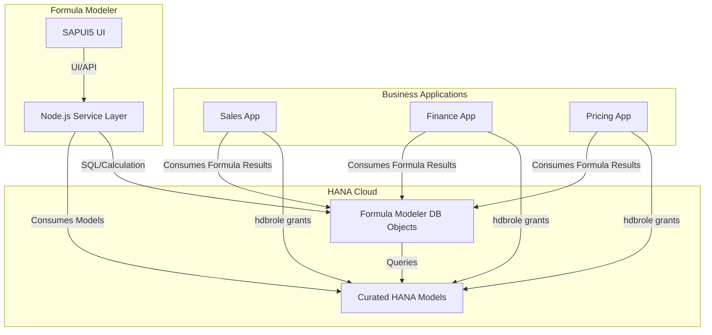

# Getting Started

Welcome to your new project.

It contains these folders and files, following our recommended project layout:

File or Folder | Purpose
---------|----------
`app/` | content for UI frontends goes here
`db/` | your domain models and data go here
`srv/` | your service models and code go here
`package.json` | project metadata and configuration
`readme.md` | this getting started guide

## Next Steps

- Open a new terminal and run `cds watch`
- (in VS Code simply choose _**Terminal** > Run Task > cds watch_)
- Start adding content, for example, a [db/schema.cds](db/schema.cds).

## Learn More

Learn more at https://cap.cloud.sap/docs/get-started/.

# Formula Modeler

## Overview

**Formula Modeler** is a full-stack application designed to empower users to create and manage formulas on curated data models, specifically for use with SAP HANA Cloud. The tool enables centralized formula management and high-performance, in-memory calculations, making it easy for various business applications to consume and leverage these formulas without duplicating data.

---

## Key Features

- **Centralized Formula Management:** Maintain all business formulas in a single, standalone application.
- **Flexible Consumption:** Formulas can be consumed by multiple business applications (e.g., Sales, Finance, Pricing) without code duplication.
- **In-Memory Calculation:** All calculations are performed directly in the HANA database for optimal performance.
- **No Data Duplication:** Formula Modeler creates database objects for querying and consuming data, rather than copying data between applications.

---

## How It Works

- Multiple business applications (such as Sales, Finance, Pricing) each have their own application containers and curated HANA models.
- Formula Modeler operates independently, allowing users to define and maintain formulas centrally.
- These formulas are then available for consumption by any business application, either through their application/service layer or directly via the database.
- The only requirement for integration is that each business application must grant the necessary privileges (via an `hdbrole`) to expose its HANA models and data to Formula Modeler.

---

## Architecture

The Formula Modeler solution consists of three main layers:

- **SAP HANA Database Container:** Stores curated data models and executes in-memory formula calculations.
- **Node.js Application (Cloud Foundry Runtime):** Hosts the business logic and service APIs.
- **SAPUI5 User Interface:** Provides a modern, user-friendly interface for managing formulas.

### Architecture Block Diagram

